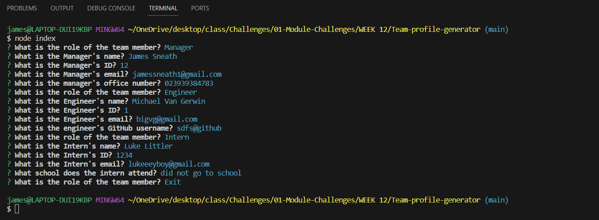
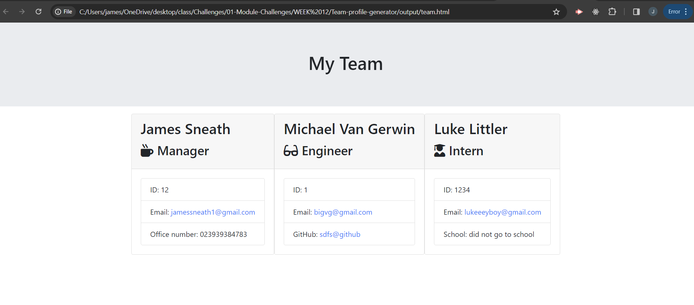

# Team-profile-generator

## Description

The Team Profile Generator is a Node.js command-line application that takes in information about employees on a software engineering team and generates an HTML webpage displaying summaries for each person. It's a quick and efficient way to create profiles for a team, including managers, engineers, and interns.

## Usage

To use this application, run: 

node index.js

You will be prompted to enter information about the team manager and then about the team members. The team members can be a mix of engineers and interns. When you have finished building your team, the application will generate a `team.html` file in the main directory, displaying a nicely formatted team roster based on the information you provided.

### Questions

The application will prompt you for the following information:

- Team member's role (Manager, Engineer, Intern, or Finish building team)
- Team member's name
- Team member's ID
- Team member's email address
- Office number (If the role is Manager)
- GitHub username (If the role is Engineer)
- School (If the role is Intern)

After all information is entered and you select 'Exit', the application will generate an HTML file named `team.html`.

## Contact

Github repo: [https://github.com/jsneath/Team-profile-generator](https://github.com/jsneath/Team-profile-generator)

